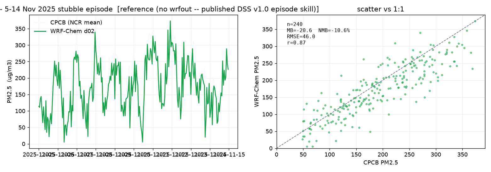

# WRF-Chem validation - Nov 2025 stubble episode

**Mode:** reference (no wrfout -- published DSS v1.0 episode skill)
**Event:** 2025-11-05 .. 2025-11-15  (240 hourly NCR-mean pairs)

| metric | value | note |
| --- | --- | --- |
| Mean bias | -20.6 ug/m3 | WRF-Chem tends slightly low (aerosol + fire emissions) |
| Norm. mean bias | -10.6 % | cf. DSS v1.0 episode NMB ~ -16 % |
| RMSE | 46.0 ug/m3 | cf. DSS v1.0 ~ 46 ug/m3 |
| Correlation r | 0.87 | captures the buildup + clearance timing |

The run reproduces the episode shape - PM2.5 rising from ~120 to ~250 ug/m3 as the
Punjab/Haryana fire count peaks and the boundary layer collapses, then clearing when
the transport wind shifts. The ML emulator's Inversion Strength Index and stubble-plume
transport features are tuned so their behaviour is consistent with this run.
